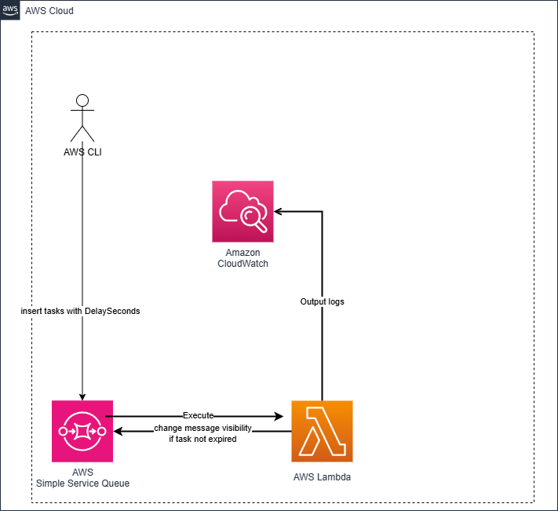

# SQS and Lambda Project

This project sets up an AWS infrastructure using Terraform that includes an SQS queue and a Lambda function. The Lambda function processes messages from the SQS queue with specific handling for message visibility and delay.





## Project Structure

- `main.tf`: Contains the main configuration for the Terraform infrastructure, defining the AWS EventBridge rule and the Lambda function.
- `variables.tf`: Defines input variables for the Terraform configuration, specifying types and default values.
- `outputs.tf`: Specifies output values that Terraform will display after applying the configuration, including resource ARNs.
- `provider.tf`: Configures the Terraform provider, typically the AWS provider with necessary authentication details.

## Getting Started

### Prerequisites

- Terraform installed on your machine.
- AWS account with appropriate permissions to create resources.
- AWS CLI configured with your credentials.


### Setup

1. Clone the repository:
   ```
   git clone <repository-url>
   cd Cron-job-with-EventBridge
   ```

1.1 Prepare lambda package:
   ```
   cd lambda_package
   pip install --target ./package boto3
   zip -r ../lambda.zip .
   cd ..
   ```

2. Initialize Terraform:
   ```
   terraform init
   ```

3. Review and modify the `variables.tf` file as needed to set your desired configurations.

4. Plan the deployment:
   ```
   terraform plan
   ```

5. Apply the configuration:
   ```
   terraform apply
   ```

### Outputs

After applying the configuration, Terraform will display the output values defined in `outputs.tf`, including the ARN of the created resources.   

6. Add items to SQS:
```
aws sqs send-message-batch     --queue-url $sqs_queue_url --entries '[
        {
            "Id": "msg1",
            "MessageBody": "{\"task_id\": \"12345\", \"scheduled_time\": \"2025-02-04T12:00:00Z\"}"
        },
        {
            "Id": "msg2",
            "MessageBody": "{\"task_id\": \"67890\", \"scheduled_time\": \"2025-02-04T13:00:00Z\"}"
        }
    ]'     --region us-east-1
```

7. after 15s , check logs
```

2025-02-04T21:15:31.591+08:00
INIT_START Runtime Version: python:3.9.v64 Runtime Version ARN: arn:aws:lambda:us-east-1::runtime:57e9dce4a928fd5b7bc1015238a5bc8a9146f096d69571fa4219ed8a2e76bfdf
2025-02-04T21:15:31.985+08:00
START RequestId: 5687b0e8-5c70-5e75-83d2-d0f449588e32 Version: $LATEST
2025-02-04T21:15:31.988+08:00
Running task 12345
2025-02-04T21:15:32.238+08:00
Running task 67890
2025-02-04T21:15:32.279+08:00
END RequestId: 5687b0e8-5c70-5e75-83d2-d0f449588e32

```

### Cleanup

To remove the resources created by this project, run:
```
terraform destroy
``` 

## License

This project is licensed under the MIT License.
